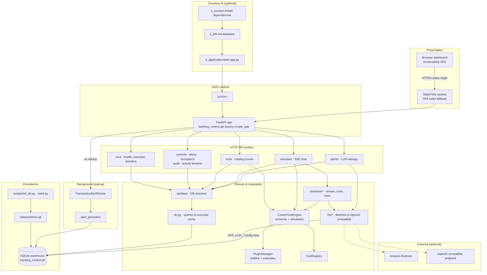
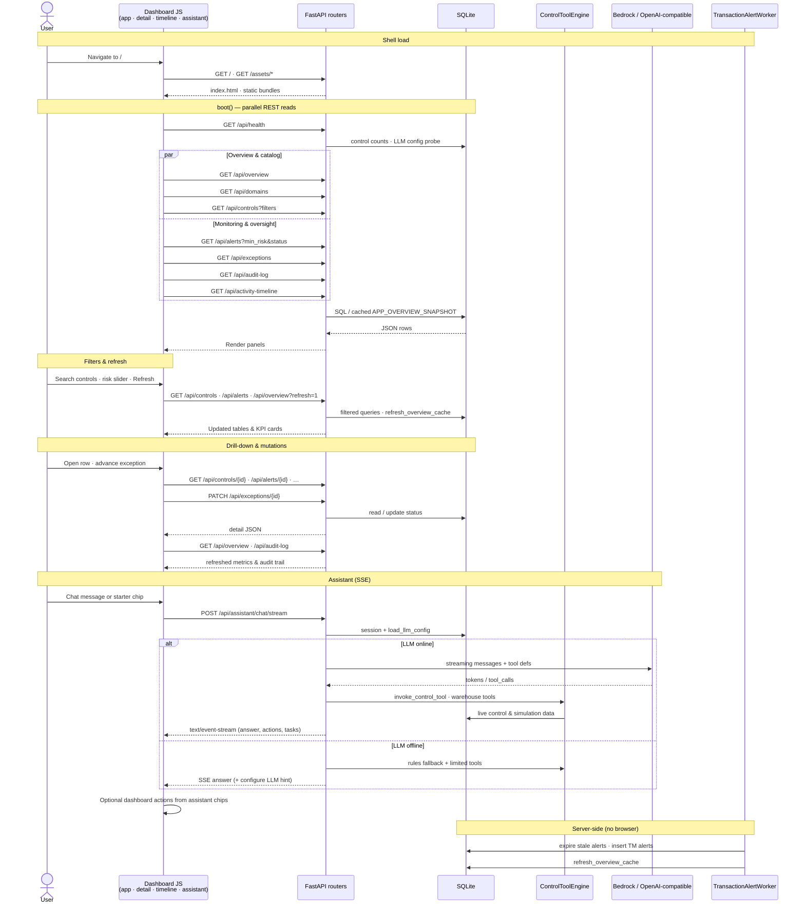

# Cloudera Blueprint: Banking Control Solution

> Operational and compliance **control tower** for banking. Catalog metadata for Cloudera AI lives in [`.project-metadata.yaml`](.project-metadata.yaml) and [`amp-catalog.yaml`](amp-catalog.yaml). All application work happens on branch **`main`**. Cloud Agents and automated edits must follow [AGENTS.md](AGENTS.md).

## Table of Contents

- [Overview](#overview)
- [Demo](#demo)
- [Use Case](#use-case)
- [Key Features](#key-features)
- [Quickstart](#quickstart)
- [Architecture / Software Components](#architecture--software-components)
  - [Logical component diagram](#logical-component-diagram)
  - [Frontend-to-backend event flows](#frontend-to-backend-event-flows)
- [Target Audience](#target-audience)
- [Repository Structure](#repository-structure)
- [Prerequisites](#prerequisites)
- [Hardware Requirements](#hardware-requirements)
- [Documentation](#documentation)
- [Development](#development)

## Overview

**Banking Control Solution** gives risk, compliance, and operations teams a single place to monitor control health across AML, KYC, SOX, cyber, credit, and related domains. A FastAPI backend and prebuilt dashboard surface assessments by business unit, transaction-monitoring alerts, open exceptions, and a full audit trail—backed by a local SQLite warehouse seeded with a realistic EU-style control catalog.

Deploy it on **Cloudera AI** as a CAI application (AMP) for a guided install → seed → serve workflow, or run the same stack locally for development. Optional **Amazon Bedrock** or **OpenAI-compatible** LLMs power a streaming control assistant with tool calling over live control data.

This repository was split from [ClouderaAppliedAI](https://github.com/royles/clouderaappliedai) (`cursor/banking-control-solution-8b7c`).

## Demo

Run the [quickstart](#quickstart) locally or import the project into Cloudera AI and open the application URL (default port **8080**). The dashboard shows overview KPIs, control catalog search, alerts, exceptions, timeline, and the foldable **Assistant** panel.

_Add a Reprise or recorded walkthrough link here when available._

## Use Case

Banks and regulated financial institutions must prove that controls are designed, tested, and operating effectively—and react quickly when monitoring surfaces issues. Scattered spreadsheets and siloed tools make it hard to see which controls are failing, which alerts need action, and what auditors already reviewed.

This blueprint demonstrates a **unified control tower**: one catalog of controls, latest assessment results, AML/monitoring alerts, remediation exceptions, and immutable audit events—plus an AI assistant that can answer questions and invoke control simulations using the same APIs.

## Key Features

- **Control catalog and health** — ~396 demo controls (94 golden MVP set) across AML, KYC, cyber, credit, and more, with latest effectiveness status by unit.
- **Transaction monitoring and exceptions** — Alert workflow states and open remediation items tied to controls.
- **Audit trail** — User and system events for oversight and demo compliance narratives.
- **LLM-callable controls** — Each control can be invoked as a tool with JSON Schema I/O and pluggable simulators ([docs/PLUGINS.md](docs/PLUGINS.md)).
- **Streaming control assistant** — SSE chat with admin LLM settings (`/api/admin/llm`) and tools over overview, controls, simulations, and audit (`/api/assistant/chat/stream`).
- **Cloudera AI packaging** — Session/job/application tasks in `.project-metadata.yaml` for install, database seed, and Uvicorn serve.

## Quickstart

### Local

```bash
git fetch origin
git checkout main
git pull origin main
python3 -m pip install -r requirements.txt
python3 -m pip install -e .
python3 scripts/init_db.py
python3 4_application/start-app.py
```

Open `http://127.0.0.1:8080/` (or the host/port printed at startup). Health check: `GET /api/health`.

### Cloudera AI (CAI / AMP)

| Stage | Script | Purpose |
| --- | --- | --- |
| 1 | `1_session-install-dependencies/install.py` | Python dependencies |
| 2 | `2_job-init-database/init_database.py` | Seed SQLite warehouse |
| 3 | `4_application/start-app.py` | API + static UI |

See [docs/CAI_APPLICATION.md](docs/CAI_APPLICATION.md) for import steps, environment variables, and port binding (`CDSW_APP_PORT` / `APP_PORT`).

### Cloud Agents

```bash
bash scripts/setup_git_hooks.sh      # optional: enables .githooks
bash scripts/ensure_branch.sh        # use in scripts/CI before builds
bash .cursor/install.sh              # dependencies + DB seed
```

## Architecture / Software Components

### Logical component diagram

Logical layers, major modules, and how they connect at runtime (single Uvicorn worker; optional Cloudera AI packaging uses the same entrypoints).



### Frontend-to-backend event flows

Typical browser-initiated flows and server-side events that refresh warehouse data without a UI call.



- **UI** — Prebuilt static assets under `frontend/dist/` served by FastAPI.
- **API** — Modular routers (controls, alerts, audit, timeline, assistant, admin) in `banking_control/api/`.
- **Data** — `data/schema.sql` and seeded tables (`DIM_CONTROL`, fact tables, overview snapshot). Generated DB files are gitignored (`data/*.db`).
- **Runtime** — `4_application/start-app.py` launches Uvicorn (`banking_control.api.main:app`) on the platform-injected port.

## Target Audience

- **Compliance and operational risk** — Officers and managers tracking control effectiveness and exceptions.
- **Solution and enterprise architects** — Evaluating a Cloudera AI–hosted control oversight pattern.
- **Developers and ML engineers** — Extending controls, simulators, plugins, or the assistant tool surface.

## Repository Structure

| Path | Description |
| --- | --- |
| `banking_control/` | Python package: API, DB, catalog, assistant, LLM, plugins |
| `4_application/` | CAI application entry (`start-app.py`, `api.py`) |
| `1_session-install-dependencies/` | CAI session: install dependencies |
| `2_job-init-database/` | CAI job: seed database |
| `frontend/dist/` | Built dashboard assets |
| `data/schema.sql` | SQLite DDL |
| `scripts/` | `init_db.py`, git hooks, branch guard |
| `docs/` | CAI deployment, plugins, extended notes |
| `.project-metadata.yaml` | Cloudera AI project / task metadata |
| `amp-catalog.yaml` | AMP catalog listing fields |
| `.cursor/` | Cloud Agent install/start scripts and `environment.json` |

## Prerequisites

- **Python** 3.10+ (3.11 recommended for CAI metadata).
- **Git** for clone and optional `.githooks` branch guard.
- **Cloudera AI** project access when deploying as an AMP (not required for local quickstart).
- **LLM (optional)** — AWS credentials for Bedrock or a reachable OpenAI-compatible endpoint for the assistant; the app runs fully without LLM configuration.

## Hardware Requirements

| Deployment | Minimum |
| --- | --- |
| Local / lab demo | 2 CPU, 4 GB RAM, ~500 MB disk for SQLite and dependencies |
| Cloudera AI application | Sized per your Workbench/CML application profile; no GPU required for the default demo |

## Documentation

- [docs/CAI_APPLICATION.md](docs/CAI_APPLICATION.md) — Deploy on Cloudera AI, environment variables, paths.
- [docs/PLUGINS.md](docs/PLUGINS.md) — Control tool plugins and simulators.
- [AGENTS.md](AGENTS.md) — Branch policy and paths owned by this project.

## Development

### Data domains

| Table | Purpose |
| --- | --- |
| `DIM_CONTROL` | EU control catalog (~396 rows, 94 MVP golden); optional `similarity_key` for overlapping controls |
| `FCT_CONTROL_ASSESSMENT` | Latest testing results by unit |
| `FCT_EXCEPTION` | Open remediation items tied to controls |
| `FCT_TRANSACTION_ALERT` | AML / monitoring alerts |
| `FCT_AUDIT_EVENT` | User and system actions |
| `APP_OVERVIEW_SNAPSHOT` | Cached KPIs for the overview API |

### Commit and push

```bash
git add -A && git commit -m "Describe the change"
git push origin main
```
